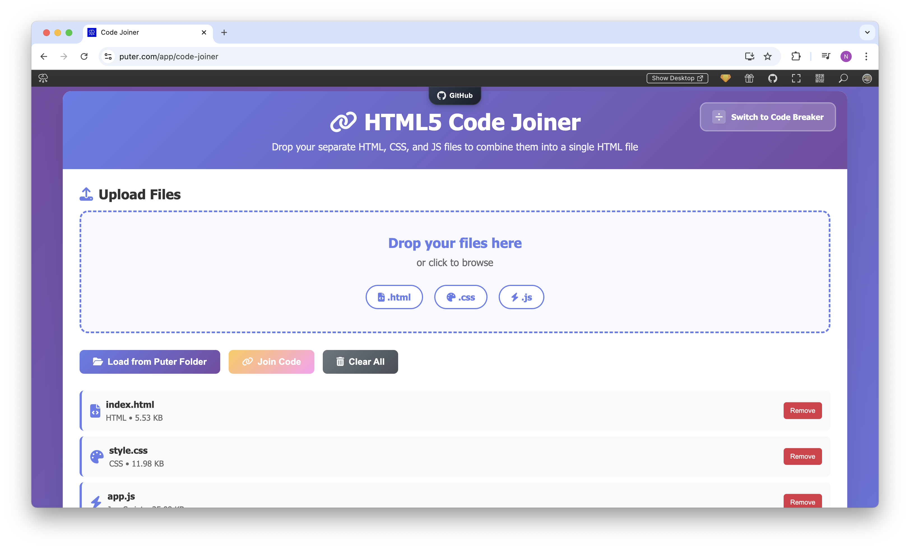

<h1 align="center">
  <a href="https://puter.com/app/code-joiner" target="_blank">Code Joiner</a>
</h1>

<p align="center">Combine separate HTML, CSS, and JavaScript files into a single, self-contained HTML file.
</p>

<p align="center">
  
</p>

<br>

## Features

- **Automatic Code Combination**: Merges separate HTML, CSS, and JavaScript files into one HTML file
- **Proper Code Embedding**: Inserts CSS in style tags and JavaScript in script tags
- **Drag & Drop Interface**: Simple file upload with drag and drop functionality
- **Puter Integration**: Load files from and save files to your Puter cloud storage
- **Live Preview**: View the combined code running in a sandboxed environment
- **Code Visualization**: View the combined code with syntax highlighting
- **Download Option**: Save the combined file to your local device
- **Copy to Clipboard**: Easily copy the entire combined code
- **Modern UI**: Clean, responsive interface that works on all devices

<br>

## Getting Started

Clone the repository: 

```bash
git clone https://github.com/puter-apps/code-joiner.git
```

Access the `src/index.html` file via a local server or an [online host](https://puter.com)

<br>

## How It Works

HTML5 Code Joiner leverages [**Puter.js**](https://developer.puter.com/) to provide a seamless web-based code combination experience:

1. **File Loading**: Upload files via drag & drop or load them from Puter cloud storage
2. **Code Merging**: Intelligently combines separate files into a single HTML document
3. **File System Integration**: Employs Puter's file system API to save generated files
4. **Authentication**: Utilizes Puter's authentication system for secure cloud storage
5. **Preview Generation**: Creates a sandboxed preview environment to test the combined code

<br>

## Companion App

Code Joiner works as a companion to [**Code Splitter**](https://puter.com/app/code-splitter), which performs the reverse operation - extracting CSS and JavaScript from a combined HTML file into separate files.

<br>

## License

MIT
